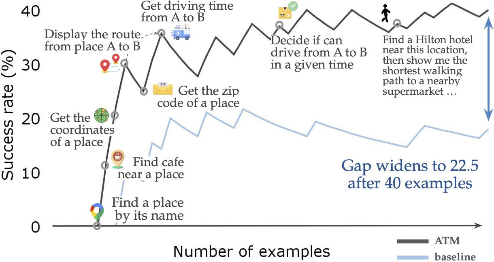
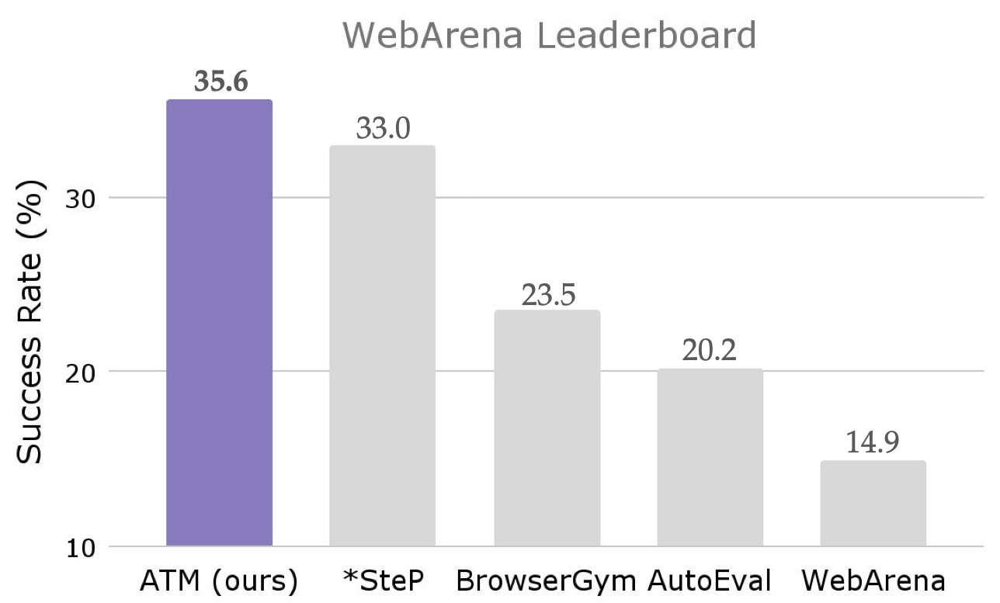
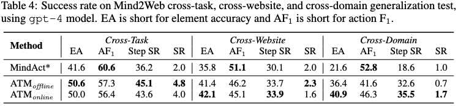

<div align="center">
  <h1>Agent Workflow Memory </h1>
  <a href="https://arxiv.org/abs/2409.07429">
    
  </a>
  <a href="https://img.shields.io/badge/PRs-Welcome-red">
    
  </a>
</div>

## Quickstart :boom:
To run AWM on WebArena under `webarena/`: 
```bash
cd webarena
python pipeline.py --website "shopping" # choose one from ['shopping', 'shopping_admin', 'reddit', 'gitlab', 'map']
```

To run AWM on Mind2Web under `mind2web/`:
```bash
cd mind2web
python pipeline.py --setup "offline" # or "online"
```
Check `webarena/` and `mind2web/` folders for more detailed instructions about environment and data setups.

## What is Agent Workflow Memory? 🧠
Agent Workflow Memory (AWM) proposes to induce, integrate, and utilize workflows via an agent memory.
A workflow is usually a common sub-routine in solving tasks, with example-specific contexts being abstracted out.

<p align="center">
  <a href="https://zorazrw/agent-workflow-memory/">
    
  </a>
</p>

AWM can operate in both offline and online settings:
- *offline* (left): when additional (e.g., training) examples are available, agents induce workflows from ground-truth annotated examples
- *online* (right): without any auxiliary data, agents induce workflows from past experiences on the fly.

<p align="center">
  <a href="https://zorazrw/agent-workflow-memory/">
    
  </a>
</p>

## How does AWM work? 📈

### On WebArena
We achieve the state-of-the-art result -- 35.6% success rate.

<p align="center">
  <a href="https://zorazrw/agent-workflow-memory/">
    
  </a>
</p>

Check the code in `./webarena/` directory.

### On Mind2Web

We also get the best scores among text-based agents. Particularly, AWM offline effectively generalizes across a wide range of tasks, websites, and domains.

<p align="center">
  <a href="https://zorazrw/agent-workflow-memory/">
    
  </a>
</p>

Check the code in `./mind2web/` directory.

## Citation 📜 

```bibtex
@inproceedings{awm2024wang,
  title = {Agent Workflow Memory},
  author = {Wang, Zhiruo anf Mao, Jiayuan, and Fried, Daniel and Neubig, Graham},
  journal={arXiv preprint arXiv:2409.07429},
  year = {2024},
}
```
